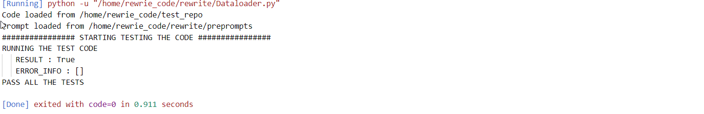
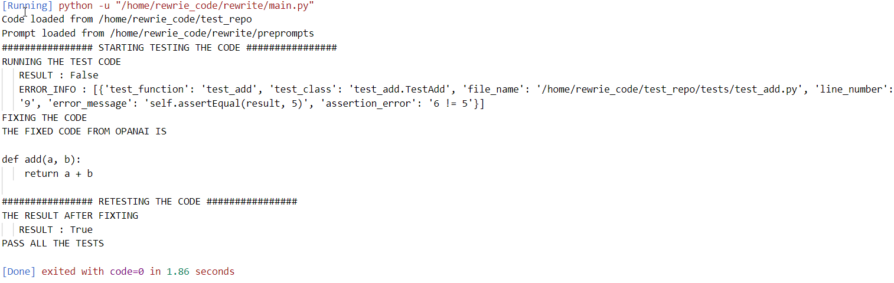

- Use OPENAI API to fix the code.
# Demo
1. set up the API in the enviroment
2. run the **main.py** to make sure the code can pass all the test case.
3. change the **add** function in func.py by adding 1 just like : 
    - from : a + b
    - to : a + b + 1
4. run the **main.py**, the program will find the bug and get correct answer via OPENAI API
# the reuslt of autofix:
- result : test sucess

- change the add function form **a+ b** to **a + b + 1**
- result : autofix yes
